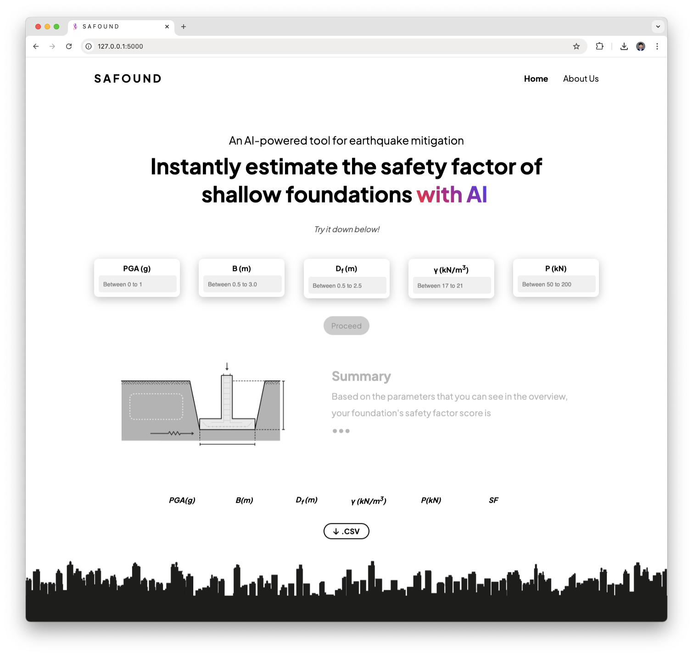
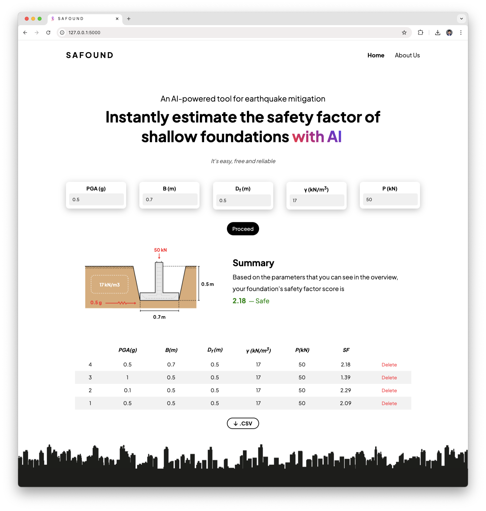

# SAFOUND - AI-Powered Safety Factor Analysis for Shallow Foundations


## Overview

SAFOUND is an AI-powered web application that instantly calculates the safety factor of shallow foundations under earthquake conditions. Leveraging the Kolmogorov-Arnold Networks (KAN) algorithm, this tool provides engineers, architects, and construction professionals with quick and reliable safety assessments for foundation designs.




## Features

- **Instant Safety Factor Calculation**: Predict the safety factor of shallow foundations with a trained KAN model
- **Interactive Interface**: User-friendly design with visual feedback of input parameters
- **Real-time Visualization**: See your foundation parameters displayed on a foundation diagram
- **Results History**: Track and compare multiple predictions in an interactive table
- **Export Functionality**: Download prediction history as CSV files for further analysis

## Input Parameters

SAFOUND analyzes shallow foundations using five key parameters:

| Parameter | Description | Unit | Recommended Range |
|-----------|-------------|------|------------------|
| PGA | Peak Ground Acceleration | g | 0.0 - 1.0 |
| Width | Foundation Width | m | 0.5 - 3.0 |
| Depth | Foundation Depth | m | 0.5 - 2.5 |
| Soil Density | Unit Weight of Soil | kN/m³ | 17.0 - 21.0 |
| Load | Applied Structural Load | kN | 50.0 - 200.0 |

## Safety Factor Interpretation

The application categorizes safety factor results as follows:

- **< 1.5**: Not Safe (Orange) - The foundation design needs revision
- **1.5 - 3.0**: Safe (Green) - The foundation design meets safety requirements
- **> 3.0**: Over Conservative (Blue) - The foundation design may be optimized for cost efficiency

## Installation and Setup

### Prerequisites

- Python 3.7 or higher
- Flask
- PyTorch
- PyKAN 0.2.5
- NumPy
- scikit-learn
- Joblib

### Installation Steps

1. Clone the repository:
   ```bash
   git clone https://github.com/yourusername/safound.git
   cd safound
   ```

2. Install required packages:
   ```bash
   pip install flask torch numpy scikit-learn joblib pykan==0.2.5
   ```

3. Run the application:
   ```bash
   python app.py
   ```

4. Open your browser and navigate to:
   ```
   http://127.0.0.1:5000/
   ```

## Project Structure

```
SAFOUND/
├── __pycache__/
├── model/
├── static/
│   ├── css/
│   │   └── styles.css
│   ├── images/
│   │   ├── Logo.png
│   │   ├── Shallow Foundation.png
│   │   ├── city-scape.jpeg
│   │   ├── foundation.png
│   │   ├── foundation2.png
│   │   └── shallow_foundation.png
│   └── js/
│       └── script.js
├── templates/
│   └── index.html
├── app.py
├── kans_model.pth
├── model.py
├── scaler.pkl
├── LICENSE
└── README.md
```

## How It Works

1. **User Input**: Enter the five foundation parameters in the input fields
2. **Prediction**: The model processes these parameters through a pre-trained KAN model
3. **Visualization**: The foundation diagram updates to show your input values
4. **Results**: The application displays the safety factor and its interpretation
5. **History**: Each prediction is stored in a table for comparison
6. **Export**: Download your prediction history as a CSV file

## Technical Details

### Model Architecture

SAFOUND uses a Kolmogorov-Arnold Network (KAN) implemented through the PyKAN library. The model architecture includes:

- Input Layer: 5 nodes (for the 5 input parameters)
- Hidden Layer: 30 nodes with grid size 15 and k=3
- Output Layer: 1 node (safety factor prediction)

### Data Processing

The application preprocesses input data using a StandardScaler (saved as `scaler.pkl`) to normalize the input values before feeding them to the model.

### Deployment

The application is built with Flask, a lightweight WSGI web application framework in Python, making it easy to deploy on various platforms including local servers, cloud services, or containerized environments.

## Browser Compatibility

SAFOUND is optimized for modern browsers including:
- Google Chrome
- Mozilla Firefox
- Microsoft Edge
- Safari

## License

This project is licensed under the terms included in the [LICENSE](LICENSE) file.

## Acknowledgments

- The KAN algorithm for providing a powerful regression modeling approach
- Flask framework for enabling lightweight web application development
- Contributors and testers who helped refine the application

## Contact

For issues, suggestions, or contributions, please open an issue in this repository.
